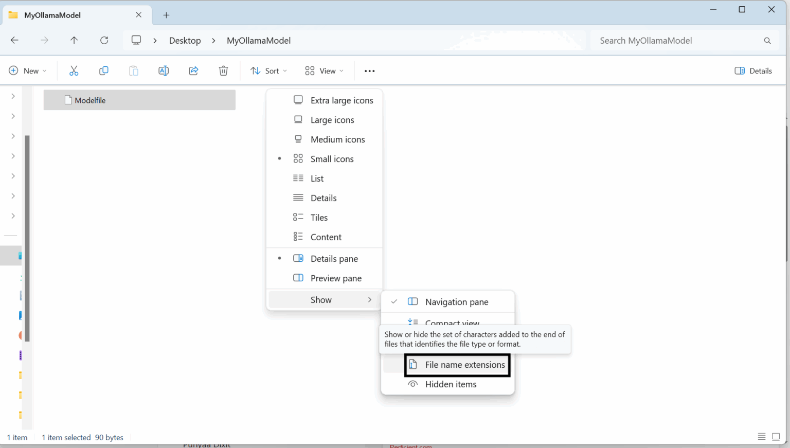

# Build, Run, and Integrate Your Own LLM with Ollama

A minimal starter repo for creating a custom local LLM with Ollama using a Modelfile and a Python integration example.


## Prerequisites
- Ollama installed and running locally (see https://ollama.com)
- A pulled base model, e.g. `ollama pull mistral`
- Python 3.9+ for the sample client

## Project layout
- [Modelfile](Modelfile) — defines the `Dev_assistant` model based on `mistral` with a punny, helpful system prompt
- [app.py](app.py) — Python chat sample against the local model
- [requirements.txt](requirements.txt) — Python dependency for the Ollama client
- [.gitignore](.gitignore) — Python and editor artifacts

## Build the custom model
1) Ensure the Modelfile is in the project root and you are in this directory.
   
   


   
3) Create the model:
   ```bash
   ollama create Dev_assistant -f Modelfile
   ```
4) Verify it appears:
   ```bash
   ollama list
   ```


## Run the model
Start an interactive chat:
```bash
ollama run Dev_assistant
```


## Python integration
1) Install the client:
   ```bash
   pip install -r requirements.txt
   ```
2) Run the sample:
   ```bash
   python app.py
   ```
   This sends a single prompt and prints the model response.


## Customize
- Adjust the system prompt or parameters in [Modelfile](Modelfile), then rebuild the model with `ollama create Dev_assistant -f Modelfile`.
- Switch the model name in [app.py](app.py) if you create a differently named model.


## Notes
- If you see `model not found`, rebuild from the Modelfile or verify Ollama is running.
- The repo is git-ready; create your GitHub repository and push when ready.

  ## For more information
  refer to this website or feel free to reach out to me!
  https://blogs.perficient.com/2025/08/01/build-run-and-integrate-your-own-llm-with-ollama/
